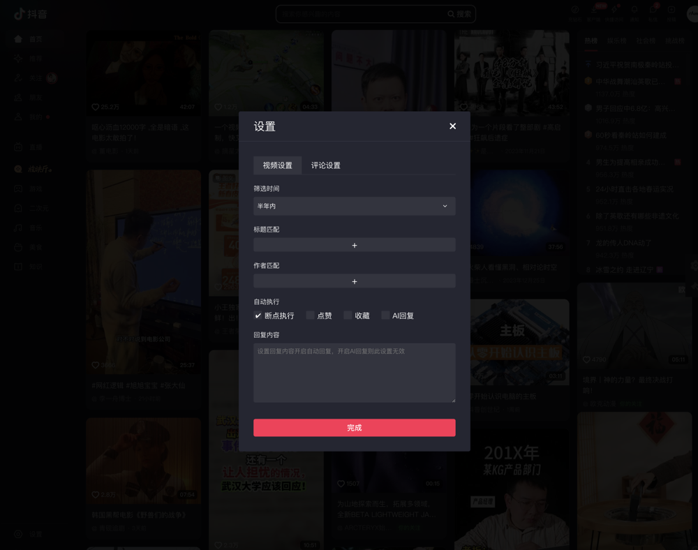
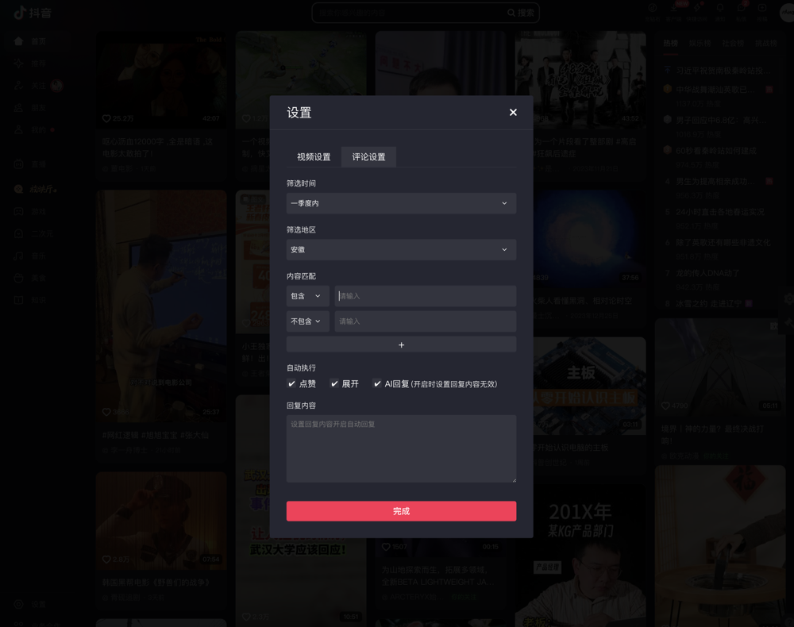

# douyin.operator

这是一个抖音自动运营工具，纯Javascript编写，使用<a href="https://www.tampermonkey.net/" style="text-decoration: none;" target="_blank">  tampermonkey</a> 扩展抖音官网，
包含视频和作者、评论和回复人的条件筛选，可以自动刷视频和自定义评论、自定义回复，其中评论和回复可以与服务器端进行交互，推荐使用HTTP代理绕过抖音的跨域验证，此处不包含服务端的响应程序，可随意定制。

我选择轻量级Http代理工具 <a href="https://wproxy.org/whistle/">whistle</a>，服务端集成了ChatGPT，测试效果还不错！

### 备注
* 抖音每个账号每天评论有上限，大约200条左右
* 交互中采用 await sleep(time) 等待操作，time值可以修改但不建议太短，频繁操作会弹出人机验证

### 使用方法
* 1.浏览器安装tampermonkey插件，推荐chrome或firefox
* 2.将douyin.operations.js脚本安装于tampermonkey中
* 3.打开抖音官网，网页右边栏出现设置和运行按钮即安装成功
* 4.打开首页、关注页点击运行或者在搜索页搜索后点击运行

<p>
如需扩展AI功能，则需要开启Http请求和Http代理，服务端程序请自行编写，将window.setting对象的aiRequestUrl属性设置为服务端请求地址即可，视频标题及评论内容将以配置的请求地址为前缀拼接。
</p>

如: aiRequestUrl = 'https://192.168.0.17:9999/m=' 则实际请求地址为 https://192.168.0.17:9999/m=这是视频标题或评论内容

### 参数设置
程序运行参数保存于window.setting对象，可以在文件中直接修改对象值，也可通过网页上的设置界面进行设置，具体参数解释如下：

```
window.setting = {
        vedio: {
            time: '7',
            title: {
                contains: [],
                notContains: []
            },
            author: {
                contains: [],
                notContains: []
            },
            isLike: false,
            isAIDialog: false,
            isCollect: false,
            postContent: null
        },
        comment: {
            area: '安徽',
            time: '7',
            content: {
                contains: [],
                notContains: []
            },
            isLike: false,
            isExpand: false,
            isAIDialog: false,
            replyContent: null
        },
        aiRequestUrl: 'https://192.168.0.17:9999/m=' 
    };
```

名称 | 类型 | 描述
--- | --- | ---
vedio.time                     | String    |  视频发布时间,默认不限,1:一天内,7:一周,30:一月内,90:一季度内,180:半年内
vedio.title.contains           | Array     |  标题包含字符串数组(正则表达式)
vedio.title.notContains        | Array     |  标题排除字符串数组(正则表达式)
vedio.author.contains          | Array     |  作者包含字符串数组(正则表达式)
vedio.author.notContains       | Array     |  作者排除字符串数组(正则表达式)
vedio.isLike                   | Boolean   |  是否自动点赞视频
vedio.isAIDialog               | Boolean   |  是否AI评论视频
vedio.isCollect                | Boolean   |  是否自动收藏视频
vedio.isBreakpoint             | Boolean   |  是否断步执行
vedio.postContent              | String    |  视频评论内容,当isAIDialog为false时生效
comment.area                   | String    |  地区筛选
comment.time                   | String    |  视频发布时间,默认不限,1:一天内,7:一周,30:一月内,90:一季度内,180:半年内
comment.content.contains       | Array     |  评论包含字符串数组(正则表达式)
comment.content.notContains    | Array     |  评论排除字符串数组(正则表达式)
comment.isLike                 | Boolean   |  是否自动点赞
comment.isExpand               | Boolean   |  是否自动展开评论
comment.isAIDialog             | Boolean   |  是否AI回复评论
comment.replyContent           | String    |  回复评论内容,当isAIDialog为false时生效

### 运行截图
#### 视频设置


#### 评论设置


